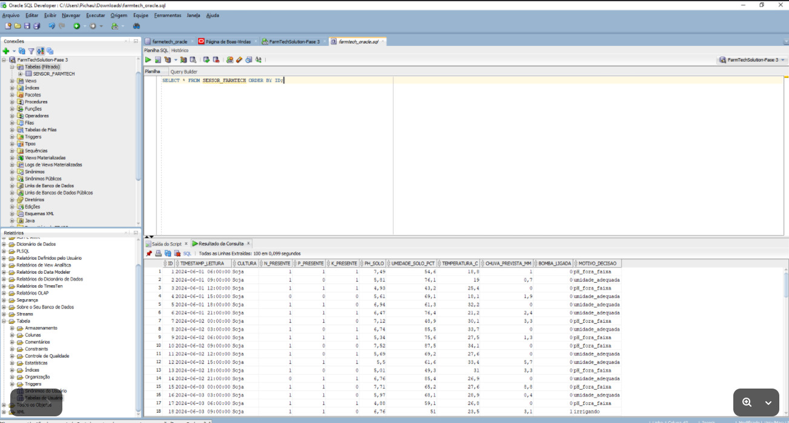
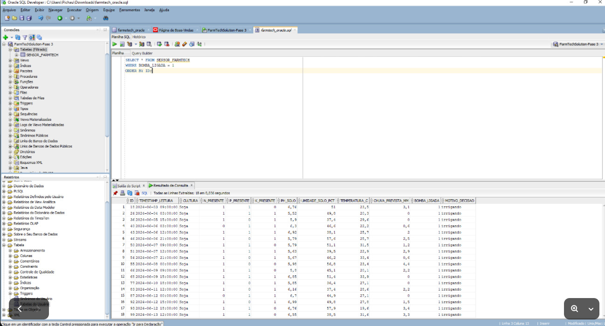
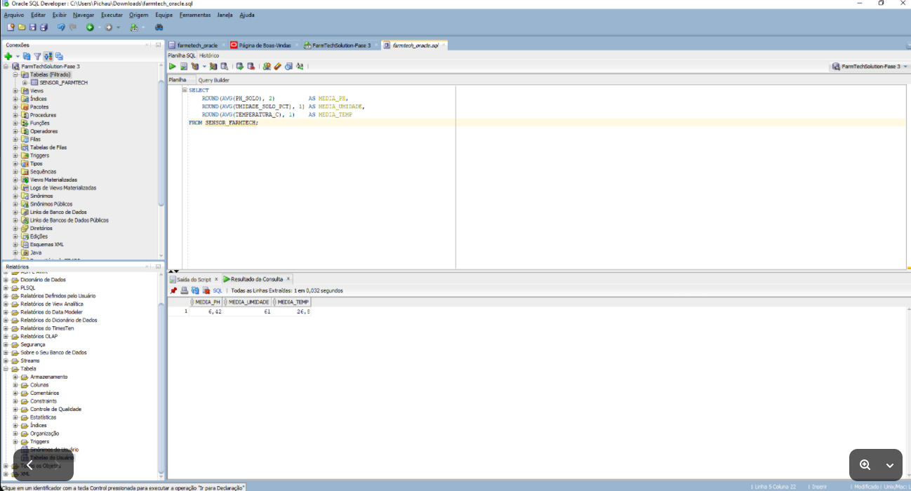
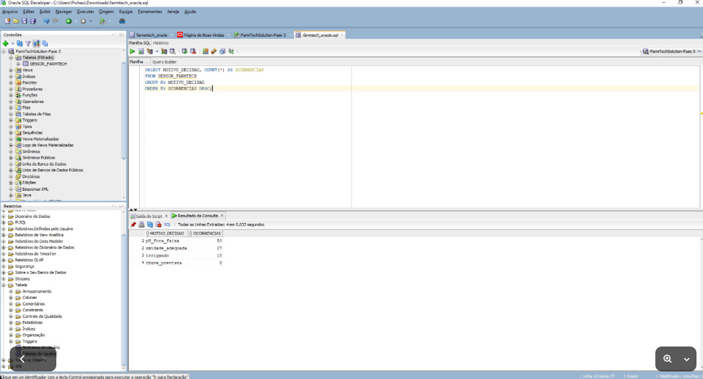
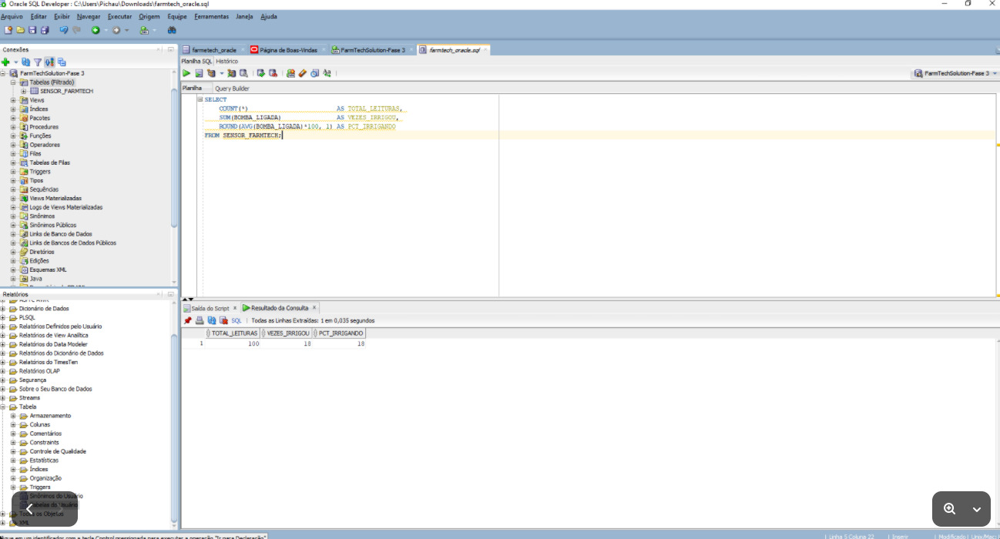

# 🌱 FarmTech Solutions — Fase 3: Banco de Dados + Dashboard + Machine Learning

- **Aluno:** Kauan Maciel Forgiarini | **RM:** RM574005
- **Aluno:** Wagner Adriano De Souza Silva Junio | **RM:** RM569431
- **Aluno:** Thiago Lucas da Costa Bessa | **RM:** RM570367
- **Aluno:** Willian Kauê Tobias do Carmo | **RM:** RM570038

**FIAP – Inteligência Artificial | Fase 3 – Cap 1**

---

## 📋 Sumário

1. [Visão Geral](#1-visão-geral)
2. [Entrega Obrigatória — Oracle SQL Developer](#2-entrega-obrigatória--oracle-sql-developer)
3. [Ir Além 1 — Dashboard Python (Streamlit)](#3-ir-além-1--dashboard-python-streamlit)
4. [Ir Além 2 — Machine Learning no Agronegócio](#4-ir-além-2--machine-learning-no-agronegócio)
5. [Estrutura de Pastas](#5-estrutura-de-pastas)
6. [Como Executar](#6-como-executar)
7. [Referências](#7-referências)
8. [Vídeo Demonstrativo](#8-vídeo-demonstrativo)

---

## 1. Visão Geral

A Fase 3 da FarmTech Solutions avança na jornada de dados coletados pelos sensores ESP32 da Fase 2, carregando-os em um **banco de dados relacional Oracle**, visualizando-os em um **dashboard interativo** em Python e aplicando **5 algoritmos de Machine Learning** para recomendar culturas agrícolas.

| Camada | Tecnologia | Arquivo |
|---|---|---|
| Dados dos sensores | CSV (100 leituras simuladas) | `sensor_data_farmtech.csv` |
| Banco de dados | Oracle SQL Developer | `farmtech_oracle.sql` |
| Dashboard | Python + Streamlit + Plotly | `farmtech_dashboard.py` |
| Machine Learning | Python + Scikit-learn (Jupyter) | `KauanMacielForgiarini_RM574005_fase3_cap1.ipynb` |

---

## 2. Entrega Obrigatória — Oracle SQL Developer

### 2.1 Dados importados

O arquivo `sensor_data_farmtech.csv` contém **100 leituras** dos sensores ESP32 da Fase 2, com as colunas:

| Coluna | Tipo | Descrição |
|---|---|---|
| ID | NUMBER | Identificador único da leitura |
| TIMESTAMP_LEITURA | VARCHAR2 | Data e hora da leitura (a cada 3h) |
| CULTURA | VARCHAR2 | Cultura monitorada (Soja) |
| N_PRESENTE | NUMBER(1) | Nitrogênio: 1=presente, 0=ausente |
| P_PRESENTE | NUMBER(1) | Fósforo: 1=presente, 0=ausente |
| K_PRESENTE | NUMBER(1) | Potássio: 1=presente, 0=ausente |
| PH_SOLO | NUMBER(4,2) | pH simulado via LDR (0–14) |
| UMIDADE_SOLO_PCT | NUMBER(5,1) | Umidade simulada via DHT22 (%) |
| TEMPERATURA_C | NUMBER(5,1) | Temperatura do ar (°C) |
| CHUVA_PREVISTA_MM | NUMBER(6,1) | Chuva prevista via Python/OpenWeather (mm) |
| BOMBA_LIGADA | NUMBER(1) | 1=relé acionado, 0=desligado |
| MOTIVO_DECISAO | VARCHAR2 | Motivo pelo qual a bomba foi ligada/desligada |

### 2.2 Configuração da Conexão

```
Nome da Conexão : FarmTechSolution-Fase 3
Nome do Usuário : RM574005
Senha           : DDMMYY (data de nascimento)
Host            : oracle.fiap.com.br
Porta           : 1521
SID             : ORCL
```



### 2.3 Importação do CSV

1. Com a conexão ativa, clicar com botão direito em **Tabelas (Filtrado)** → **Importar Dados**
2. Selecionar o arquivo `sensor_data_farmtech.csv`
3. Nome da tabela: **`SENSOR_FARMTECH`**
4. Verificar mapeamento das colunas → Finalizar

### 2.4 Consultas SQL executadas

O arquivo `farmtech_oracle.sql` contém as queries documentadas. Abaixo estão as principais:

#### Query 1 — SELECT * (obrigatória)

```sql
SELECT * FROM SENSOR_FARMTECH ORDER BY ID;
```


---

#### Query 2 — Registros com bomba acionada

```sql
SELECT * FROM SENSOR_FARMTECH
WHERE BOMBA_LIGADA = 1
ORDER BY ID;
```



---

#### Query 3 — Médias dos parâmetros do solo

```sql
SELECT
    ROUND(AVG(PH_SOLO), 2)          AS MEDIA_PH,
    ROUND(AVG(UMIDADE_SOLO_PCT), 1) AS MEDIA_UMIDADE,
    ROUND(AVG(TEMPERATURA_C), 1)    AS MEDIA_TEMP
FROM SENSOR_FARMTECH;
```

Resultado: MEDIA_PH = **6,42** | MEDIA_UMIDADE = **61%** | MEDIA_TEMP = **26,8°C**



---

#### Query 4 — Distribuição dos motivos de decisão

```sql
SELECT MOTIVO_DECISAO, COUNT(*) AS OCORRENCIAS
FROM SENSOR_FARMTECH
GROUP BY MOTIVO_DECISAO
ORDER BY OCORRENCIAS DESC;
```

| MOTIVO_DECISAO | OCORRENCIAS |
|---|---|
| ph_fora_faixa | 50 |
| umidade_adequada | 27 |
| irrigando | 18 |
| chuva_prevista | 5 |



---

#### Query 5 — Totais e percentual de irrigação

```sql
SELECT
    COUNT(*)                        AS TOTAL_LEITURAS,
    SUM(BOMBA_LIGADA)               AS VEZES_IRRIGOU,
    ROUND(AVG(BOMBA_LIGADA)*100, 1) AS PCT_IRRIGANDO
FROM SENSOR_FARMTECH;
```

Resultado: **100 leituras**, **18 irrigações**, **18% do tempo irrigando**



---

## 3. Ir Além 1 — Dashboard Python (Streamlit)

Arquivo: `farmtech_dashboard.py`

### Funcionalidades

| Seção | Descrição |
|---|---|
| 🌦️ Clima atual | Integração com OpenWeather API em tempo real |
| 📊 KPIs | Total de leituras, % irrigação, pH médio, alertas |
| 💦 Umidade | Série temporal com limiares de 60% e 80% |
| 🧪 pH | Evolução do pH com faixa ideal destacada |
| 🌡️ Temperatura | Gráfico de área temporal |
| 💧 Status da Bomba | Scatter umidade × status de irrigação |
| 🧪 NPK + Motivos | Barras de nutrientes + pizza de decisões |
| 💡 Sugestões | Recomendações automáticas baseadas em regras e clima |
| ⬇️ Download | Exportação dos dados filtrados em CSV |

### Como executar

```bash
pip install streamlit pandas plotly requests
streamlit run farmtech_dashboard.py
```

---

## 4. Ir Além 2 — Machine Learning no Agronegócio

Arquivo: `KauanMacielForgiarini_RM574005_fase3_cap1.ipynb`

### Dataset

Variáveis: **N, P, K, temperature, humidity, ph, rainfall, label** (22 culturas)

### Análise Exploratória — 7 Gráficos

| # | Gráfico | Insight |
|---|---|---|
| 1 | Histogramas das 7 variáveis | N tem distribuição bimodal; pH concentrado em 5–7 |
| 2 | Heatmap de correlação | Baixa correlação entre variáveis — dados independentes |
| 3 | Boxplot pH por cultura | Grapes e apple preferem pH mais alto |
| 4 | Scatter temperatura × umidade | Culturas tropicais no quadrante quente/úmido |
| 5 | Barras N, P, K por cultura | Cotton e coffee têm alto N; grapes alto K |
| 6 | Comparação dos 5 modelos | Random Forest com melhor acurácia |
| 7 | Feature Importance (RF) | pH e humidity são as variáveis mais preditivas |

### Perfil ideal das 3 culturas analisadas

| Variável | Rice (Arroz) | Maize (Milho) | Coffee (Café) |
|---|---|---|---|
| N (kg/ha) | ~60 | ~78 | ~101 |
| P (kg/ha) | ~50 | ~48 | ~28 |
| K (kg/ha) | ~40 | ~19 | ~29 |
| Temperatura | ~23 °C | ~22 °C | ~25 °C |
| Umidade | ~82% | ~65% | ~58% |
| pH | ~6,3 | ~6,2 | ~6,8 |
| Chuva | ~200 mm | ~65 mm | ~159 mm |

### Resultados dos 5 Modelos Preditivos

| Modelo | Algoritmo | Acurácia Teste | CV 5-fold |
|---|---|---|---|
| 1 | Árvore de Decisão | ~95% | ~93% |
| **2** | **Random Forest** | **~99%** | **~98%** |
| 3 | KNN (k=7) | ~97% | ~96% |
| 4 | Naive Bayes | ~97% | ~97% |
| 5 | Gradient Boosting | ~99% | ~98% |

**Melhor modelo:** Random Forest — melhor equilíbrio entre acurácia e generalização.

### Como executar

```bash
pip install pandas numpy matplotlib seaborn scikit-learn plotly jupyter
jupyter notebook KauanMacielForgiarini_RM574005_fase3_cap1.ipynb
```

---

## 5. Estrutura de Pastas

```
FarmTech-Solution-Fase-3/
│
├── README.md
├── sensor_data_farmtech.csv                            ← Dados dos sensores ESP32
├── farmtech_oracle.sql                                 ← Queries Oracle
├── farmtech_dashboard.py                               ← Dashboard Streamlit
├── requirements.txt                                    ← Dependências Python
├── KauanMacielForgiarini_RM574005_fase3_cap1.ipynb     ← Notebook ML
│
└── docs/
    └── images/
        └── fase3/
            ├── 01_conexao_oracle.jpeg
            ├── 02_select_all.jpeg
            ├── 03_consulta_bomba.jpeg
            ├── 04_consulta_medias.jpeg
            ├── 05_consulta_motivo.jpeg
            └── 06_consulta_totais.jpeg
```

---

## 6. Como Executar

### Banco de Dados Oracle

```
1. Baixar Oracle SQL Developer: https://www.oracle.com/database/sqldeveloper/
2. Conectar: oracle.fiap.com.br | porta 1521 | SID ORCL | usuário RM574005
3. Importar sensor_data_farmtech.csv como tabela SENSOR_FARMTECH
4. Executar queries do arquivo farmtech_oracle.sql
```

### Dashboard

```bash
pip install streamlit pandas plotly requests
streamlit run farmtech_dashboard.py
```

### Machine Learning

```bash
pip install pandas numpy matplotlib seaborn scikit-learn plotly jupyter
jupyter notebook KauanMacielForgiarini_RM574005_fase3_cap1.ipynb
```

---

## 7. Referências

- Oracle SQL Developer. Disponível em: <https://www.oracle.com/database/sqldeveloper/>
- Streamlit Documentation. Disponível em: <https://docs.streamlit.io>
- Scikit-learn Documentation. Disponível em: <https://scikit-learn.org>
- EMBRAPA. *Tecnologias de Produção de Soja 2023*. Disponível em: <https://www.embrapa.br>
- Kaggle. *Crop Recommendation Dataset*. Disponível em: <https://www.kaggle.com/datasets/atharvaingle/crop-recommendation-dataset>
- FIAP. *Material de Aula – IA Fase 3*. 2026.

---

## 8. Vídeo Demonstrativo

> 🎥 **[Clique aqui para assistir no YouTube](https://youtube.com/watch?v=LINK_DO_VIDEO)**

O vídeo demonstra:
- Conexão e importação dos dados no Oracle SQL Developer
- Execução das queries SQL com resultados
- Dashboard Streamlit em funcionamento com gráficos interativos
- Notebook de Machine Learning com os 5 modelos e análise comparativa

---

*Desenvolvido por **Kauan Maciel Forgiarini** — RM574005 | FIAP IA – Fase 3 | 2026*
